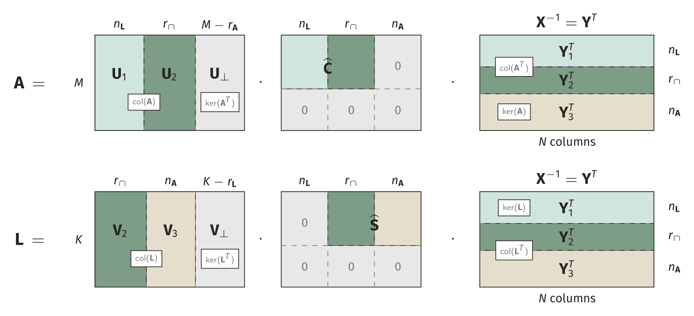

- [`pytikhonov`](https://github.com/jlindbloom/pytikhonov): Tikhonov regularization with GSVD diagnostics and parameter-selection methods.
- [`easygsvd`](https://github.com/jlindbloom/easygsvd): A Python interface to the generalized singular value decomposition.
- [`blockcg`](https://pypi.org/project/blockcg/): Pure-Python implementations of block conjugate gradient methods.
- [`gpcg`](https://pypi.org/project/gpcg/): Conjugate-gradient optimization for bound-constrained quadratic programs.
- [`rjpo`](https://pypi.org/project/rjpo/): Reversible-jump perturbation optimization for high-dimensional Gaussian sampling.
- [`runningstatistics`](https://pypi.org/project/runningstatistics/): Online sample statistics for array-valued data streams.
- [`gsvdm2py`](https://pypi.org/project/gsvdm2py/): A Python wrapper around MATLAB's generalized singular value decomposition.

Additional projects are available on [GitHub](https://github.com/jlindbloom).

{.software-diagram fig-alt="Block-structure diagram of a generalized singular value decomposition" width="3275" height="1494" loading="lazy"}
